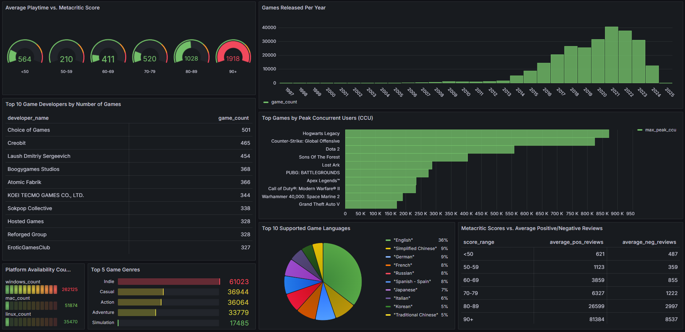

# SteamDataPipeline

<p align="center">
  
  
  
  
</p>
<p align="center">
  
  
  
  
  
  
</p>

This project creates a scalable data pipeline that collects and processes data from both Steam and SteamSpy, stores it in AWS S3, and provides tools for data analysis and visualization. This pipeline can be used for analyzing trends in the gaming industry, creating visual dashboards, and more.

## Overview

The SteamDataPipeline integrates multiple components to scrape, store, and analyze data from the Steam platform. The scraper gathers game information and statistics from Steam's API and SteamSpy, then uploads the data to an S3 bucket. The entire process is automated using AWS services, with data processing and visualization implemented using Polars, PostgreSQL, and Grafana respectively.

### Features:
- **Scalable Scraper:** The Steam scraper is designed to handle large amounts of data while complying with API rate limits.
   - **JSON Format:** Data is read from and written to JSON files for ease of use and compatibility.
   - **Retry Logic and Backoff Strategies:** The scraper includes retry logic for handling API failures and rate-limiting.
- **AWS Integration:** Collected data is stored on Amazon S3.
- **Monitoring:** The pipeline utilizes logs to monitor the scraping process and AWS CloudWatch for further insights.
- **Data Processing:** Polars is used for data processing and transformation.
- **Containerization:** Docker is used for containerizing the application, ensuring consistency across environments.
- **Data Storage:** PostgreSQL is used for storing processed data.
- **Data Visualization:** Grafana is connected to the data pipeline to provide real-time insights into the scraped data.
- **Automated Scheduling:** AWS Lambda used to automate the scraper, ensuring data is collected at regular intervals.

## Core Functionality

This pipeline is designed to efficiently scrape and process data from Steam and SteamSpy. It's a heavily modified version of [FronkonGames' Steam Games Scraper](https://github.com/FronkonGames/Steam-Games-Scraper), with significant enhancements for improved performance, scalability, and code readability.

## Technologies Used
- **Python 3.9**: The primary language for the scraper and data processing.
- **AWS S3**: To store the scraped data.
- **AWS EC2**: Used for running the scraper to handle the large Steam dataset.
- **Polars**: Used for data processing and transformation.
- **PostgreSQL**: Used for data storage.
- **Grafana**: Used for visualization.
- **Docker**: Used for containerizing the application.

## Project Structure
```
SteamDataPipeline/
├── src/
│   ├── utils.py                 # Data processing and S3 operations
│   ├── config.py                # Project configuration
│   ├── steam_scraper.py         # Steam API scraping logic
│   └── api.py                   # API interaction functions
├── transformer/                 
│   └── polars_transformer.py    # Polars transformer
├── loader/                      
│   └── postgres_loader.py       # Postgres loader
├── tests/                       
│   ├── test_scraper.py          # Tests for scraper
│   ├── test_utils.py            # Tests for utility functions
│   └── test_api.py              # Tests for API functions
├── data/                        # Scraping output files
├── parquet_tables/              # Parquet files for processed data
├── Dockerfile                   # Dockerfile for Docker container (WIP)
├── docker-compose.yml           # Docker Compose file for container orchestration (WIP)
├── run_pipeline.sh              # Script to run the entire pipeline (WIP)
├── README.md                    # Project documentation
└── requirements.txt             # Required libraries
```

## Data Flow

The current data flow in the pipeline is as follows:

1. Data is scraped from Steam and SteamSpy APIs
2. Scraped data is stored in AWS S3
3. Data is loaded into Polars for processing and transformation
4. Processed data is saved as Parquet files
5. Parquet files are loaded into PostgreSQL
6. Grafana connects to PostgreSQL to visualize the data in real-time dashboards

## Installation

To get started with SteamDataPipeline, you'll need to:

1. Clone the repository:
   ``` bash
    git clone https://github.com/Vyshnav12/SteamDataPipeline.git
   ```

2. Install the required dependencies:
    ``` bash
    pip install -r requirements.txt
    ```

3. Set up your AWS credentials for S3 access. You can do this by either:
   - Setting environment variables: `AWS_ACCESS_KEY_ID` and `AWS_SECRET_ACCESS_KEY`
   - Or by configuring the AWS CLI: `aws configure`

## Running the Scraper

Execute the scraper using:

```bash
python src/steam_scraper.py [arguments]
```
Use the argument `-h` to see all the arguments and their descriptions.

### Example

```bash
python src/steam_scraper.py --sleep 2 --retries 5 --autosave 100 --bucket my-steam-data-bucket
```

This sets a 2-second delay, 5 retries, saves every 100 entries, and uses the 'my-steam-data-bucket' S3 bucket.

### EC2 Background Execution

```bash
nohup python3 src/steam_scraper.py > logs/output.log 2>&1 &
```

Note: Default values are defined in `config.py`.

## Data Processing with Polars

The `transformer/polars_transformer.py` script processes the scraped data using Polars and saves the results as Parquet files.

To run the data transformation:

```bash
python transformer/polars_transformer.py
```

## Loading Data into PostgreSQL

The `loader/postgres_loader.py` script loads the Parquet files into PostgreSQL.

To load the data into PostgreSQL:

```bash
python loader/postgres_loader.py
```

## Testing

This project uses Python's built-in `unittest` framework for testing. The tests are located in the `tests/` directory.

### Running Tests

To run all tests, use the following command from the project root directory:

```bash
python -m unittest discover tests
```

To run a specific test file, use:

```bash
python -m unittest tests/test_utils.py
```

Replace `test_utils.py` with the name of the test file you want to run.

## Data Storage

This project primarily relies on AWS S3 for data storage. However, you can modify the `utils.py` file to enable local storage if needed.

## Data Modeling with DBT

The `steam_games_dbt/` directory contains the DBT project for data modeling. It contains the following:

- **Models:** Located in `steam_games_dbt/models/`, these transform the raw data into more usable formats.
- **Analyses:** Found in `steam_games_dbt/analyses/`, these provide insights into the data.
- **Tests:** Located in `steam_games_dbt/tests/`, these ensure data quality and model accuracy.

To run DBT:

```bash
cd steam_games_dbt
dbt run
dbt test
dbt compile
```

Details regarding the use of DBT in thisproject can be found [here](steam_games_dbt/README.md).

## Docker Containerization

The `Dockerfile` and `docker-compose.yml` files are in the root directory.

### Running the Full Pipeline

To run the entire pipeline automatically:

2. Execute the pipeline:
   ```bash
   ./run_pipeline.sh
   ```

This script builds all Docker images and runs the services in the correct order: Scraper, DuckDB setup, DBT models

For manual execution of individual services:

```bash
docker-compose run scraper
docker-compose run duckdb_setup
docker-compose run dbt
```

## Data Visualization with Grafana

After loading the data into PostgreSQL, a Grafana dashboard can be implemented to provide real-time insights into the scraped Steam data.

<p align="center">
  
</p>

The Grafana dashboard offers interactive visualizations of various metrics and trends from the Steam dataset, allowing for easy analysis and decision-making based on the collected data.

To access the Grafana dashboard:
1. Ensure that PostgreSQL is running and contains the loaded data
2. Start the Grafana server
3. Log in to Grafana and navigate to the Steam Data Pipeline dashboard

For detailed instructions on setting up and using the Grafana dashboard, please refer to the [Grafana Documentation](docs/grafana_setup.md).

## Future Enhancements

I plan to expand SteamDataPipeline with the following features:
- **AWS Lambda Integration**: Lambda functions will be implemented to further automate and scale certain pipeline processes.
- **Additional Data Analysis**: More data analysis features will be added using Polars.

## Contributing

Contributions are welcome! Please feel free to submit a Pull Request.

## Acknowledgment

Special thanks to [Martin Bustos aka FronkonGames](https://github.com/FronkonGames) for providing the foundation that made this project possible.

## License

This project is licensed under the MIT License - see the LICENSE file for details.


